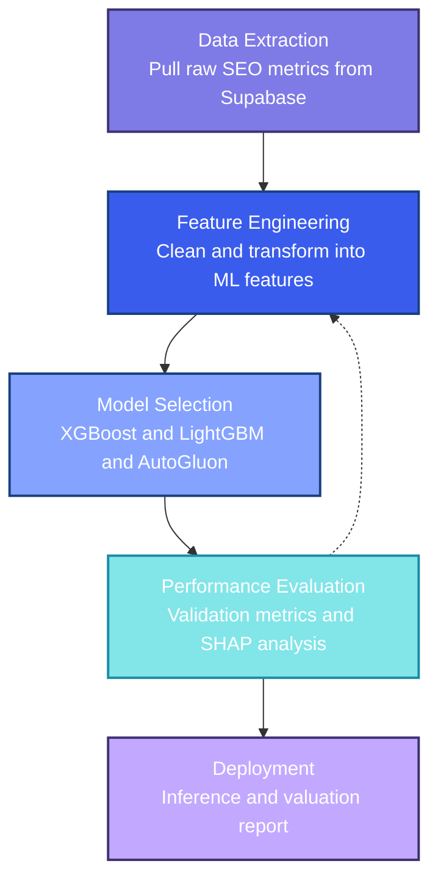

# Backlink Pricing Model

Machine learning pipeline for predicting fair market valuations for backlink placements. Pulls SEO metrics from Supabase, engineers domain quality signals, and trains an ensemble that replaces subjective estimates with data-driven prices.

## Table of contents

- [How it works](#how-it-works)
- [Setup](#setup)
- [Pipeline commands](#pipeline-commands)
- [Project layout](#project-layout)
- [Dataset and features](#dataset-and-features)
- [License](#license)

---

## How it works

Raw SEO data comes in, features go out, a model predicts a price. Three stages:

1. **Extraction**: pulls domain metrics from Supabase (Domain Rating, Trust Flow, organic traffic, TLD, niche)
2. **Engineering**: cleans outliers, imputes missing values, builds derived signals like traffic-to-authority ratios and historical acquisition trends
3. **Modeling**: trains XGBoost and LightGBM with Optuna HPO for interpretability, and an AutoGluon ensemble as the primary production path; SHAP analysis explains each prediction



---

## Setup

Requires Python 3.12 or 3.13 and [uv](https://astral.sh/uv).

```bash
git clone https://github.com/vytautas-bunevicius/backlink-pricing-model.git
cd backlink-pricing-model
uv sync --all-extras --dev
source .venv/bin/activate
```

Copy [.env.example](.env.example) and fill in your Supabase credentials:

```bash
cp .env.example .env
```

Supabase credentials go in `.env`, never hardcoded or committed.

Run tests:

```bash
uv run pytest
```

---

## Pipeline commands

A [Makefile](Makefile) orchestrates the full end-to-end flow.

| Command | What it does |
|---|---|
| `make pipeline` | Full run: extract, preprocess, train, evaluate |
| `make extract` | Pull fresh data from Supabase |
| `make preprocess` | Clean and engineer features |
| `make train` | XGBoost with Optuna HPO (full budget) |
| `make train-quick` | XGBoost with 10 Optuna trials |
| `make train-autogluon` | AutoGluon ensemble (1h default) |
| `make train-autogluon-quick` | AutoGluon with 10 min time limit |
| `make evaluate` | Validation metrics and SHAP plots |
| `make predict INPUT=path/to/csv` | Batch inference on new domains |
| `make test` | Run unit tests |

---

## Project layout

```
src/backlink_pricing_model/
├── core/           # shared types and config
├── preprocessing/  # data cleaning and feature engineering
├── modeling/       # XGBoost, LightGBM, AutoGluon wrappers
├── analysis/       # feature selection and SHAP
├── visualization/  # plotting helpers
└── utils/          # misc

scripts/
├── data_pipeline/  # Supabase extraction entrypoint
├── preprocess.py   # cleaning and feature engineering
├── train.py        # XGBoost and LightGBM with Optuna HPO
├── train_autogluon.py
├── evaluate.py
└── predict.py

notebooks/          # EDA, feature engineering, modeling walkthroughs
configs/            # YAML config for preprocessing and training
data/               # raw and processed dataset snapshots
models/             # saved model artifacts
```

---

## Dataset and features

### Data source

Backlink placement records stored in Supabase, exported as `data/raw/backlinks.parquet` by `make extract`. Each row is one placement with a known final price and the SEO metrics of the target domain at time of purchase. The required schema is defined in [core/models/preprocessing.py](src/backlink_pricing_model/core/models/preprocessing.py).

To replicate the model you need a Parquet or CSV file with at least these columns:

| Column | Type | Description |
|---|---|---|
| `final_price` | float | Agreed placement price (the prediction target) |
| `dr` | float | Ahrefs Domain Rating (0-100) |
| `tf` | float | Majestic Trust Flow (0-100) |
| `cf` | float | Majestic Citation Flow (0-100) |
| `domain_traffic` | float | Estimated monthly organic visits |
| `country` | string | Domain registrant country code |
| `date_received` | date | Date the placement offer was received |

Optional columns that improve accuracy when present:

| Column | Type | Description |
|---|---|---|
| `initial_price` | float | Asking price before negotiation |
| `domain` | string | Domain name (used to extract TLD) |
| `niche` | string | Content category (tech, health, finance, etc.) |
| `language` | string | Primary language of the site |
| `link_type` | string | dofollow, nofollow, sponsored, UGC |

### Engineered features

Built on top of the raw columns by [feature_engineering.py](src/backlink_pricing_model/preprocessing/feature_engineering.py) during `make preprocess`:

- **Log transforms**: `log_price` and `log_traffic` to compress the long-tail distributions of price and traffic
- **TLD extraction**: top-level domain parsed from the domain name; rare TLDs are collapsed into an `other` bucket
- **Quality tiers**: DR, TF, and CF bucketed into five bands (very_low / low / medium / high / premium)
- **Price ratio**: `final_price / initial_price` as a negotiation signal (requires `initial_price`)
- **Temporal features**: year, month, and quarter extracted from `date_received` to capture seasonal pricing trends
- **Missingness flags**: binary indicators for missing CF, TF, and country (absence itself is informative for newer or low-quality domains)

---

## License

This is free and unencumbered software released into the public domain. Do whatever you want with it. See [LICENSE](LICENSE) for the full Unlicense text.
