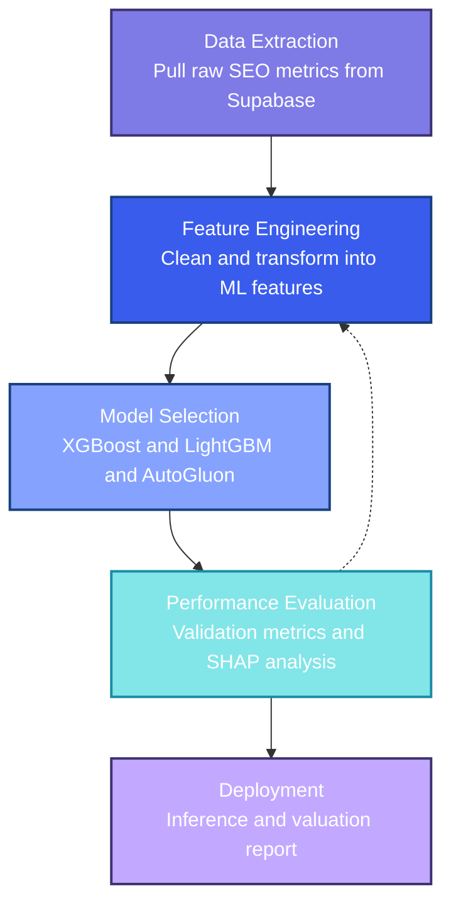

# Backlink Pricing Model

Machine learning pipeline for predicting fair market valuations for backlink placements. Pulls SEO metrics from Supabase, engineers domain quality signals, and trains an ensemble that replaces subjective estimates with data-driven prices.

## Table of contents

- [How it works](#how-it-works)
- [Project layout](#project-layout)
- [Pipeline commands](#pipeline-commands)
- [Setup](#setup)
- [License](#license)

---

## How it works

Raw SEO data comes in, features go out, a model predicts a price. Three stages:

1. **Extraction**: pulls domain metrics from Supabase (Domain Rating, Trust Flow, organic traffic, TLD, niche)
2. **Engineering**: cleans outliers, imputes missing values, builds derived signals like traffic-to-authority ratios and historical acquisition trends
3. **Modeling**: trains XGBoost and LightGBM with Optuna HPO for interpretability, and an AutoGluon ensemble as the primary production path; SHAP analysis explains each prediction



---

## Project layout

```
src/backlink_pricing_model/
├── core/           # shared types and config
├── preprocessing/  # data cleaning and feature engineering
├── modeling/       # XGBoost, LightGBM, AutoGluon wrappers
├── analysis/       # feature selection and SHAP
├── visualization/  # plotting helpers
└── utils/          # misc

scripts/
├── data_pipeline/  # Supabase extraction entrypoint
├── preprocess.py   # cleaning and feature engineering
├── train.py        # XGBoost and LightGBM with Optuna HPO
├── train_autogluon.py
├── evaluate.py
└── predict.py

notebooks/          # EDA, feature engineering, modeling walkthroughs
configs/            # YAML config for preprocessing and training
data/               # raw and processed dataset snapshots
models/             # saved model artifacts
```

---

## Pipeline commands

A [Makefile](Makefile) orchestrates the full end-to-end flow.

| Command | What it does |
|---|---|
| `make pipeline` | Full run: extract, preprocess, train, evaluate |
| `make extract` | Pull fresh data from Supabase |
| `make preprocess` | Clean and engineer features |
| `make train` | XGBoost with Optuna HPO (full budget) |
| `make train-quick` | XGBoost with 10 Optuna trials |
| `make train-autogluon` | AutoGluon ensemble (1h default) |
| `make train-autogluon-quick` | AutoGluon with 10 min time limit |
| `make evaluate` | Validation metrics and SHAP plots |
| `make predict INPUT=path/to/csv` | Batch inference on new domains |
| `make test` | Run unit tests |

---

## Setup

Requires Python 3.12 or 3.13 and [uv](https://astral.sh/uv).

```bash
git clone https://github.com/vytautas-bunevicius/backlink-pricing-model.git
cd backlink-pricing-model
uv sync --all-extras --dev
source .venv/bin/activate
```

Copy the environment template and fill in your Supabase credentials:

```bash
cp .env.example .env
```

Supabase credentials go in `.env`, never hardcoded or committed.

Run tests:

```bash
uv run pytest
```

---

## License

This is free and unencumbered software released into the public domain. Do whatever you want with it. See [LICENSE](LICENSE) for the full Unlicense text.
