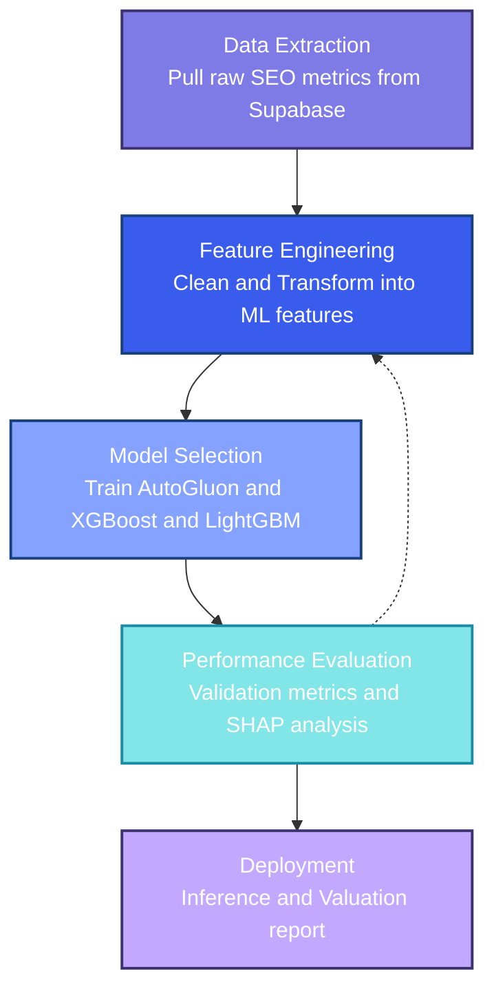

# Backlink Pricing Model: Engineering Manual

The Backlink Pricing Model is a professional-grade machine learning pipeline for predicting fair market valuations of backlink placements. It standardizes pricing decisions by analyzing domain quality signals from industry-standard sources like Ahrefs and Majestic.

---

## Operational Overview

This project provides a data-driven framework to move away from subjective SEO estimates toward objective valuations. It processes several key metrics—including Authority (DR/TF), Traffic, and Contextual signals—into a unified pricing prediction suitable for marketing procurement and inventory planning.

---

## Component Specifications

The pipeline is implemented as a modular Python package within [src/backlink_pricing_model/](src/backlink_pricing_model/), following a clear separation of data lifecycle stages.

### 1. Data Processing and Feature Engineering
The [preprocessing module](src/backlink_pricing_model/preprocessing/) manages the transition from raw API extracts to model-ready tabular datasets.
*   **Data Cleaning**: [data_cleaning.py](src/backlink_pricing_model/preprocessing/data_cleaning.py) handles outlier removal, missing value imputation, and consistency checks across data sources.
*   **Engineering**: [feature_engineering.py](src/backlink_pricing_model/preprocessing/feature_engineering.py) generates domain-specific signals like traffic-to-authority ratios and normalized pricing buckets.

### 2. Analytical Surfaces
The [analysis module](src/backlink_pricing_model/analysis/) performs automated evaluation of features and model transparency.
*   **Feature Selection**: Ranking and pruning of redundant features via importance analysis in [feature_selection.py](src/backlink_pricing_model/analysis/feature_selection.py).
*   **Explainability**: SHAP value calculation for high-confidence interpretability of price predictions in [shap_analysis.py](src/backlink_pricing_model/analysis/shap_analysis.py).

### 3. Training and Inference
Modeling logic is encapsulated in the [modeling module](src/backlink_pricing_model/modeling/).
*   **Optimization**: Automated hyperparameter tuning via Optuna integration for gradient-boosted trees (XGBoost/LightGBM).
*   **AutoML**: Production-grade ensemble modeling via [AutoGluon](https://auto.gluon.ai/) for maximum predictive accuracy.

---

## Reproducible Workflow

A [Makefile](Makefile) orchestrates the pipeline stages. Common commands include:
*   `make pipeline`: Full Pipeline: Extract → Preprocess → Train.
*   `make extract`: Pull raw SEO data from Supabase to `data/raw/`.
*   `make preprocess`: Execute cleaning and engineering logic.
*   `make train-ag`: Train with AutoGluon in Best Quality mode.
*   `make evaluate`: Generate metric reports and evaluation plots.

---

## Standards and Security

### Code Quality
- **Naming Conventions**: Strict adherence to **snake_case** for all functions, variables, and saved model artifacts.
- **Documentation**: All public APIs must follow the Google Python Style Guide for docstrings.

### Data Security
- **Credentials**: Supabase and API access keys must be stored in a local `.env` file (never committed) or a secure secret manager.
- **Data Lifecycle**: Raw datasets should be treated as ephemeral and stored in gitignored `data/` directories.

---

## Deployment and Monitoring
- **CI/CD**: Pushing to `main` triggers automated linting and unit testing via GitHub Actions.
- **Inference**: High-volume batch predictions are executed using `make predict INPUT=path/to/csv`.

---

## Maintenance
- **Responsible Team**: Growth Marketing Tools
- **Point of Contact**: Vytautas Bunevicius (vytautas.bunevicius@nordsec.com)
